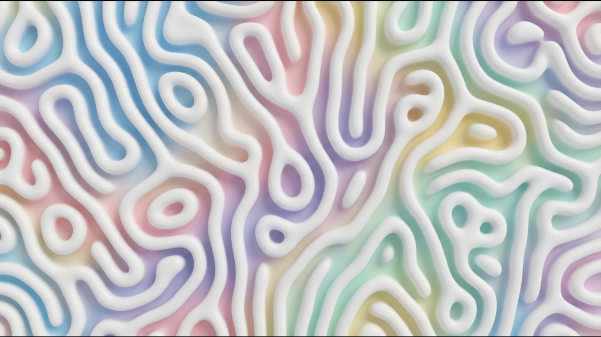

# 🌈 Organic Animal Print 3D Shader Background

Un shader procedural interactivo en **WebGL 2 (GLSL ES 3.00)** que reproduce un fondo animado en tiempo real con cordones tubulares 3D de arcilla blanca que forman patrones laberínticos de animal print (estilo Gyroid / Turing pattern) que se mueven, fluyen, se separan y se juntan de manera orgánica sobre un fondo de gradientes pastel irisados.



---

## ✨ Características

- **Geometría Procedural 3D Continua**:
  - Corte planar 2D sobre una celda unitaria de superficie mínima triplemente periódica (*3D Gyroid minimal surface slice*), orientada a lo largo de la diagonal isométrica $(1,1,1)$ para eliminar cualquier sesgo de rejilla cartesiana.
  - *Domain Warping* bicapa (*Curl/Sinusoidal Warping*) que infunde la curvatura fluida y sinuosa propia de patrones biológicos como piel de cebra, corales y huellas dactilares.
  - Perfil de altura semicilíndrico abovedado con contacto suave, calculando normales de superficie precisas por diferencias finitas en tiempo real.
- **Material y Modelo de Iluminación**:
  - Arcilla / cerámica blanca satinada con sombreado difuso suave (*wrapped diffuse*).
  - Resalte especular Blinn-Phong sutil con atenuación Fresnel.
  - Oclusión ambiental profunda en hendiduras y ranuras de contacto.
  - Sombras arrojadas direccionales suaves (*soft drop shadows*) sobre el fondo del valle.
  - Rebote de luz subsuperficial (*subsurface radiosity bounce*) que refleja sutilmente los tonos pastel sobre los flancos inferiores de los tubos.
- **Fondo con Remolino Arcoíris & Gradiente Diagonal en Movimiento**:
  - Vórtice dinámico de colores pastel (remolino en rotación continua con brazos espirales de rosa rubor, lavanda, celeste cielo, menta, amarillo manteca y melocotón).
  - Gradiente diagonal continuo viajando a 45 grados por encima del remolino con ondas cromáticas y resalte luminoso tipo velo satinado.
  - Rebote de luz subsuperficial (*subsurface radiosity bounce*) que proyecta los colores del fondo en movimiento sobre los flancos inferiores de los cordones de arcilla blanca.
- **Interacción Fluida**:
  - Puntero / ratón: campo de deformación con amortiguamiento inercial suave (*lerp* continuo) que empuja o reúne los cordones.
  - Clic / tap: desencadena una onda líquida expansiva (*click ripple*) que perturba el campo de forma elástica.
- **7 Formas y Geometrías Procedurales**:
  - ☘️ **Tréboles 3D (`Tecla 1`)**: Lazos trilobulados y tréboles continuos con simetría ternaria (corte isométrica Gyroid).
  - 🦓 **Cebra Flow (`Tecla 2`)**: Bandas sinuosas continuas de animal print con bifurcaciones en "Y" y curvas serpenteantes.
  - 🪸 **Coral / Células (`Tecla 3`)**: Células biomórficas y arrecifes de coral con cámaras redondeadas.
  - 🌊 **Ondas Seda (`Tecla 4`)**: Cintas y olas líquidas paralelas que ondean suavemente por la pantalla.
  - 🫧 **Gotas Bio (`Tecla 5`)**: Gotas y perlas líquidas que flotan, colisionan y se fusionan orgánicamente.
  - ❤️ **Corazones 3D Puffy (`Tecla 6`)**: Corazones de arcilla blanca sólidos y abultados (100% rellenos, sin huecos interiores ni ranuras en los lóbulos).
  - 🦴 **Huesitos de Perro 3D Chunky (`Tecla 7`)**: Huesos de perro sólidos y corpulentos con 4 nódulos redondeados prominentes y rotación fluida en 360 grados.
  - *Atajos rápidos*: Presiona las teclas numéricas del `1` al `7` para alternar de forma al instante.
- **Panel de Control Flotante Glassmorphism**:
  - 6 Presets preconfigurados (*Pastel Clay Original*, *Zebra Minimal*, *Cotton Candy*, *Coral Reef*, *Cyber Neon*, *Golden Pearl*).
  - Sliders interactivos para velocidad, densidad, grosor, profundidad 3D, fuerza del cursor, brillo y sombras.
  - Atajos de teclado: `H` (ocultar/mostrar panel), `Espacio` (alternar tarjeta de demo/fondo limpio), `F` (pantalla completa).
  - Modal de exportación para copiar el snippet en 1 clic (HTML autónomo, Three.js o GLSL Fragment).

---

## 🚀 Inicio Rápido

Simplemente abre el archivo `index.html` en tu navegador:
```bash
# O abrir directamente en Windows:
start index.html

# O utilizando cualquier servidor local simple si prefieres:
npx serve .
# o
python -m http.server 8080
```

---

## 📦 Cómo usarlo como Fondo en tu Web

### Opción 1: Snippet HTML Directo (Plug & Play)

Pega el siguiente bloque antes de cerrar el `</body>` de tu página web:

```html
<canvas id="shader-bg" style="position:fixed;top:0;left:0;width:100vw;height:100vh;z-index:-1;pointer-events:none;"></canvas>

<script>
(function() {
  const canvas = document.getElementById('shader-bg');
  const gl = canvas.getContext('webgl2', { alpha: false, powerPreference: 'high-performance' });
  if (!gl) return;

  const vs = `#version 300 es
  in vec2 p; out vec2 v; void main(){ v=(p+1.)*.5; gl_Position=vec4(p,0,1); }`;

  // Copia el fragment shader desde shader.frag o usa el app.js del repositorio
})();
</script>
```

*(Puedes presionar el botón **"Exportar Código"** dentro de la interfaz para copiar el código completo listo para pegar).*

### Opción 2: Three.js

En Three.js puedes asignarlo como un `RawShaderMaterial` sobre un plano a pantalla completa en una escena ortográfica. Consulta el modal de exportación en la app para ver el código generado.

---

## 🎥 Uso en OBS Studio (Fuente de Navegador)

El proyecto incluye una versión optimizada y limpia creada específicamente para **OBS Studio**: [`obs.html`](obs.html).

- **Sin interfaz**: No muestra botones, paneles ni textos, solo el fondo en pantalla completa.
- **Movimiento autónomo**: Cuando no hay interacción de ratón, un cursor virtual se desplaza suavemente de forma orgánica y genera ondas líquidas periódicas para que la escena nunca se vea estática en stream.
- **Fondo transparente opcional**: Puedes aislar los cordones 3D y utilizarlos como overlay sobre tu cámara o juego con `?transparent=1`.
- **Rendimiento optimizado**: Bloqueado a 60 FPS (o 30 FPS vía parámetro) y nunca se pausa aunque OBS esté en segundo plano.

### Cómo configurarlo en OBS Studio en 4 pasos:

1. En OBS, ve al panel **Fuentes** y haz clic en **`+`** -> **Navegador** (*Browser Source*).
2. Marca la casilla **"Archivo local"** (*Local file*) y presiona **Examinar** para seleccionar el archivo `obs.html`.
   *(O si lo tienes alojado en un servidor web/localhost, ingresa la URL).*
3. Configura:
   - **Ancho (*Width*)**: `1920` (o la resolución de tu lienzo)
   - **Alto (*Height*)**: `1080`
   - **FPS**: `60` (o `30`)
   - **CSS personalizado**: Deja el valor por defecto (`body { background-color: rgba(0, 0, 0, 0); margin: 0px auto; overflow: hidden; }`).
   - Marca **"Apagar fuente cuando no esté visible"** (*Shutdown source when not visible*).
4. Haz clic en **Aceptar**. ¡Listo!

### Parámetros URL para personalizar tu fuente OBS:

Puedes añadir parámetros a la URL (o al final de la ruta) para personalizar el estilo directamente:

```text
obs.html?shape=corazones&preset=cotton
obs.html?shape=cebra&preset=zebra&speed=0.6
obs.html?shape=gotas&transparent=1
obs.html?shape=ondas&preset=neon&fps=30
```

| Parámetro | Valores posibles | Descripción |
| :--- | :--- | :--- |
| `shape` | `0`..`6`, o nombres (`treboles`, `cebra`, `coral`, `ondas`, `gotas`, `corazones`, `huesitos`) | Forma geométrica activa |
| `preset` | `0`..`5`, o nombres (`pastel`, `zebra`, `cotton`, `coral`, `neon`, `golden`) | Paleta de colores |
| `transparent` | `1` o `true` (por defecto `0`) | Fondo 100% transparente para superposición en stream |
| `speed` | decimal (ej: `0.75`) | Velocidad de movimiento de los cordones |
| `bgSpeed` | decimal (ej: `1.0`) | Velocidad del remolino de fondo |
| `scale` | número (ej: `44.0`) | Densidad y tamaño de los elementos |
| `thickness` | decimal (ej: `0.52`) | Grosor de las bandas |
| `depth` | decimal (ej: `1.6`) | Relieve y sensación tridimensional |
| `fps` | `60`, `30`, `0` (sin límite) | Límite de FPS para reducir consumo de GPU |
| `auto` | `1` (activado) o `0` (desactivado) | Movimiento virtual orgánico automático |
| `ripples` | `1` (activado) o `0` (desactivado) | Ondas líquidas periódicas automáticas |

### Control en Vivo en OBS ("Interactuar"):

Si haces clic derecho sobre la fuente en OBS y seleccionas **"Interactuar"** (*Interact*):
- **Ratón**: Puedes tocar o arrastrar para empujar los cordones en vivo.
- **Teclas `1` a `7`**: Cambia de forma al instante en plena transmisión.
- **Tecla `P`**: Alterna entre los 6 presets de color.
- **Tecla `T`**: Alterna entre fondo transparente y fondo sólido pastel.
- **Tecla `A`**: Activa/desactiva el movimiento automático.
- **Tecla `R`**: Dispara una onda expansiva líquida.

---

## 📁 Estructura del Repositorio

```
shader.sx/
├── index.html       # Aplicación web completa con visor y controles interactivos
├── obs.html         # Versión optimizada para OBS Studio (Browser Source)
├── app.js           # Runtime WebGL2, gestión de uniforms, física del cursor y eventos
├── style.css        # Estilos modernos con glassmorphism y diseño responsivo
├── shader.frag      # Fragment Shader GLSL ES 3.00 limpio y documentado
├── shader.vert      # Vertex Shader quad de paso
└── README.md        # Esta documentación
```

---

## 🎨 Parámetros del Shader

| Parámetro | Uniform | Descripción | Rango habitual |
| :--- | :--- | :--- | :--- |
| **Modo de Forma** | `u_shapeMode` | 0: Tréboles, 1: Cebra, 2: Coral, 3: Ondas, 4: Gotas, 5: Corazones, 6: Huesitos | `0 - 6` |
| **Escala / Densidad** | `u_scale` | Tamaño del patrón laberíntico | `15.0 - 90.0` |
| **Velocidad de Cordones** | `u_speed` | Rapidez con que los tubos fluyen y se fusionan | `0.1 - 2.5` |
| **Velocidad de Fondo** | `u_bgSpeed` | Rapidez del remolino y gradiente diagonal | `0.0 - 3.0` |
| **Grosor** | `u_thickness` | Ancho de las bandas de animal print | `0.20 - 0.65` |
| **Relieve 3D** | `u_depth` | Extrusión de las normales y sensación de volumen | `0.5 - 3.5` |
| **Fuerza del Cursor** | `u_mouseForce` | Intensidad de la deformación elástica del ratón | `0.0 - 1.5` |
| **Brillo Especular** | `u_specular` | Resalte satinado sobre los cordones | `0.1 - 2.0` |
| **Sombras** | `u_shadows` | Oscurecimiento de valles y sombras arrojadas | `0.0 - 1.0` |
| **Saturación** | `u_saturation` | Intensidad cromática del gradiente pastel | `0.0 - 2.0` |

---

## 📄 Licencia

MIT © 2026. Libre para uso personal y comercial.
